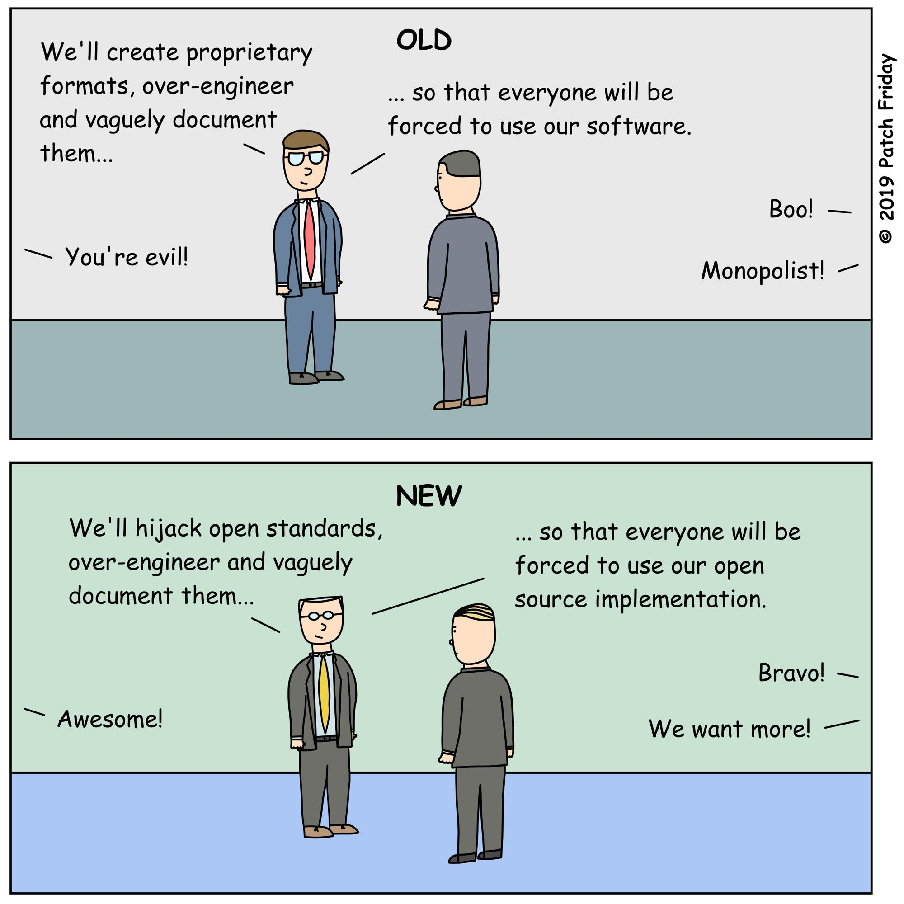
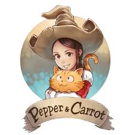

<!-- _class: lead -->

# Le (logiciel) libre a-t-il 
# de beaux jours devant lui ?

---

## ~# whoami

Denis GERMAIN

🌅 Site Reliability Engineer

🌃 Auteur sur [blog.zwindler.fr](https://blog.zwindler.fr)*

 @zwindler / @zwindler_rflx

**#geek** 🎮 **#SF** 🤖 **#courseAPied** 🏃‍♂️

 

**Les slides de ce talk sont sur le blog*

---

<!-- _class: lead -->

# Le (logiciel) libre a-t-il 
# de beaux jours devant lui ?

---

<!-- _class: lead -->

# Dis papa, c'est quoi le (logiciel) libre ?

---

## Logiciel Libre

Définition GNU ()

* « Logiciel libre » désigne des logiciels qui respectent la liberté des utilisateurs.

* [...] Les utilisateurs ont la liberté d'exécuter, copier, distribuer, étudier, modifier et améliorer ces logiciels.

> « Free as in free speech, not free beer »

---

# Le libre, c'est pas que du logiciel !

Partager des connaissances, de la culture, c'est aussi faire "du libre"

> Les biens communs, ou tout simplement **communs**, sont des ressources, gérées collectivement par une communauté [...] dans le but de préserver et pérenniser cette ressource. 

   

[Les communs d'abord](https://www.les-communs-dabord.org/communs-de-quoi-parle-t-on/)

---

## Open Source (≠ Logiciel Libre)

Définition GNU (encore)

* En 1998, une partie de la communauté a […] commencé à faire […] de l'« open source »

* Le mouvement open source vise à promouvoir le logiciel libre en lui retirant l’aspect idéologique (= politique)

* [GNU.org - Open Source misses the point](https://www.gnu.org/philosophy/open-source-misses-the-point.html)

---

## Free software versus Open source software

Dans la pratique,

* Cette distinction est très peu connue du « grand public IT »
* De nombreux logiciels dits « open source » sont « libres »

---

<!-- _class: lead -->

# "Libre bashing"

*crédits : AFP*

---

## Voici comment on est vu de l’extérieur

Guillaume Meurice (France Inter) est au Paris Open Source Summit   

<video controls="controls" width="800" src="binaries/meurice.mp4"></video>

---

## Ennemis (historique) de l’Open Source ?

<video controls="controls" width="800" src="binaries/microsoft_dance.mp4"></video>

---

## Ennemis de l’Open Source ?

> **Linux est un cancer** qui, au sens de la propriété intellectuelle, corrompt ce qu’il touche

Steve Ballmer (PDG) en 2001 
(*crédits : Dan DeLong*)

---

## Ennemis de l’Open Source ?

> Il existe des **communistes d’un genre nouveau**, qui souhaitent abolir toute forme de rémunération pour les musiciens, artistes du cinéma et développeurs de logiciels

Bill Gates en 2005

---

## Ok pour hier. Mais aujourd'hui ?

Dans le top10 des éditeurs de logiciels dans le monde, 4 sont (très) connues pour leur catalogue de "logiciels propriétaires"

---

## 

[zwindler.fr - l’open source bashing a encore de beaux jours devant lui](https://blog.zwindler.fr/2018/10/19/lopen-source-bashing-a-encore-de-beaux-jours-devant-lui/)

---

##  "On collecte, on connecte, ça marche"

---

## 

MySQL est la base de données open source la plus populaire au monde grâce à sa fiabilité, sa facilité d'utilisation et ses performances avérées. (*source : oracle.com*)

 

Si vous utilisez MySQL, vous allez devoir sacrifier énormément de stabilité, sécurité et performance. C’est un très vieux système.
**Larry Ellison (PDG d’Oracle) en 2018**

[Tech republic - Why does Oracle keep trashing its own product](https://www.techrepublic.com/article/why-does-oracle-keep-trashing-mysql-its-own-product/)

---

<!-- _class: lead -->

# La communauté Open Source

---

## La communauté Open Source

Les gestionnaires de dépendances / paquets / modules

 **install**

<video controls="controls" width="600" src="binaries/npminstall.mp4"></video>

[https://twitter.com/garrows/status/1065217184643768320](https://twitter.com/garrows/status/1065217184643768320)

---

## La communauté Open Source

* Mainteneur unique de **event-stream**

* Package NPM très populaire avec plusieurs millions (!!!) de téléchargements hebdomadaires

* Plus maintenu depuis des années

* Utilisé par de très nombreux packages 
  * *(Et donc de très nombreux logiciels)*

---

## Et là, c’est le drame

[https://github.com/dominictarr/event-stream/issues/116](https://github.com/dominictarr/event-stream/issues/116)

---

## Les "dangers" de l'Open Source

---

## Heartbleed / Curl

Le problème ne date pas d'hier et ne se limite pas à NPM ! 

Deux autres exemples :

* Curl - virtuellement maintenu par une personne de 1998
* OpenSSL - [faille Heartbleed](https://en.wikipedia.org/wiki/Heartbleed) en 2014

[OneZero - The Internet Relies on People Working for Free](https://onezero.medium.com/the-internet-relies-on-people-working-for-free-a79104a68bcc) & [xkcd/2347](https://xkcd.com/2347/)

---

<!-- _class: lead -->

# Qui pour sauver l'open source ?

---

## Open source versus Proprietary

 FIRST 
<b>THEY IGNORE YOU.</b> 
THEN 
<b>THEY LAUGH AT YOU.</b> 
THEN 
<b>THEY FIGHT YOU.</b> 
THEN 
<b>YOU WIN.</b> 

---

## Redhat; **the** OSS company

Créée en 1993, entreprise surtout connue pour Redhat Entreprise Linux, CentOS, Fedora, Openshift, ...

* Souvent citée en exemple de l’open source "qui marche"
* 3.4 Md$ de chiffre d'affaire en 2019

---

## Et là, c'est le drame (oui, encore...)

---

## IBM + redhat = ❤️

---

<!-- _class: lead -->

# Qui contribue le plus ?

---

## Vous pouvez répéter la question ?

> Dans le monde, quelle entitée contribue le plus de "code ouvert" ?

---

## Qui contribue le plus ?

Est ce que c'est Redhat ? C'est leur coeur de métier après tout

* 

---

## Qui contribue le plus ?

> "Indice sur vos écrans"

**C'est un cloud provider connu**

* ... mais ce n'est certainement pas eux !
* 

---

## Qui contribue le plus ?

Même s'ils sont bons 2èmes, ce n'est pas eux non plus

* 
* 

---

## Les ~~ennemis~~ amis de l'Open Source

> « We are all in on open source » 

Satya Nadella (CEO actuel de Microsoft)

[Etude "State of the octoverse" 2018](https://octoverse.github.com)

---

## Encore plus amis de l'Open Source

* 2017 - Microsoft rejoint l'OSI 

* 2018 - Microsoft libère 60k brevets

* 2018 - Microsoft achète 

* 2019 - La  donne une conf' à Redmond

[Microsoft saute le pas et met 60 000 brevets à disposition de Linux](https://siecledigital.fr/2018/10/12/microsoft-saute-le-pas-et-met-60-000-brevets-a-disposition-de-linux/)

---

## Toujours plus amis de l'Open Source

* 2020 - Conférence Linux aurait du (COVID-19) avoir lieu au siège, à Redmond !

* 2020 - Microsoft achète 

[Site de la WSL Conf 1](https://www.wslconf.dev/wslconf1)

---

## Changement ou openwashing ?

Adoption massive de l'open source dans "le cloud"

Beaucoup n'ont pas oublié **"Embrace, Extend and Extinguish"**

[Embrace, Extend, Extinguish](https://fr.wikipedia.org/wiki/Embrace,_extend_and_extinguish) - [PatchFriday](https://twitter.com/PatchFriday/status/1174960629817364481?s=20)

---

<!-- _class: lead -->

# Le libre pour sauver le monde

---

## Le libre peut redonner du sens à nos vies

Titre d'un article de [Framasoft qui parle de Bernard Stiegler](https://framablog.org/2012/03/02/bernard-stiegler-logiciel-libre/).

Philosophe qui s'inspire énormément du libre pour tenter d'imaginer une société plus juste : "une économie de la contribution".

Crédits: [Berkeley Center for New Media ](https://www.flickr.com/people/50571263@N02)

---

## Open Food Facts

> Open Food Facts est une base de données sur les produits alimentaires faite par tout le monde, pour tout le monde.

* Une base de données communautaire ouverte
* Plus de 700.000 produits renseignés
* 
* On peut même contribuer à tout, même au code

[Github de Open Food Facts](https://github.com/openfoodfacts)

---

## Culture libre = moyen age ?

[Le tweet en question](https://twitter.com/dirtybiology/status/773149041437868032?s=20)

---

## So far, so good

> Tous les épisodes de Pepper & Carrot sont publiés en libre accès sur Internet via le site de David Revoy [...] sous licence Creative Commons BY (Paternité). 

> Celle-ci est très ouverte, puisqu’elle autorise toutes les formes de réutilisation (y compris à caractère commercial) à condition de citer le nom de l’auteur.

[S.I.Lex - Pepper et Carrot : BD Open Source chez Glénat](https://scinfolex.com/2016/08/30/pepper-et-carrot-une-bande-dessinee-open-source-publiee-chez-glenat/)

---

## Mais dans les commentaires...

> Un investissement sans limites de cet auteur passionné doublé d’un combat quasi politique pro « Open Source » (alors que **sous couvert de modernité**, on est juste revenu sur la place du marché **en plein moyen âge quand les saltimbanques** essayaient de vivre des pièces jetées par les passants).

**#saltimbaque #neocommuniste**

[Blog zwindler.fr - Licence libre, auteurs du web et copyright](https://blog.zwindler.fr/2016/09/09/2223/)

---

## Se déplacer sans qu'on vende mes données

[Tweet de Jerome Herbinet](https://twitter.com/Jerome_Herbinet/status/1304660394980642819?s=19)

--- 

## Grâce à OSM, on peut aussi un peu rigoler

212 étages dans *Flight Simulator* à cause d'une typo dans OSM

---

<!-- _class: lead -->

# Conclusion

---

## Conclusion [Sarcarsm ON]

* Logiciel libre ≠ Logiciel Open Source
  * et tout le monde s’en fout™ 

* Le libre, ce n’est pas que des logiciels

* L’Open Source c’est le cancer*
  * *sauf si on peut faire de l’argent avec

* Faire du libre fait de vous un saltimbanque néocommuniste....
  * ... mais arrêter de maintenir vos projets mettra la vie de millions d’innocents en danger

---

## Conclusion [Sarcasm OFF]

Contribuer au libre c'est cool, c'est participer à un monde meilleur

[https://twitter.com/BenLesh/status/1119770730185363456?s=19](https://twitter.com/BenLesh/status/1119770730185363456?s=19)

---

## That's all folks

---

<!-- _class: lead -->

# Des questions ?
# Ca vous a plu ?

---

<!-- _class: lead -->

# Bonus !

---

## Le super sketchnote de @ane_naiz

---

## Bonus Microsoft

La FSF n'est plus ennemi juré de Microsoft, mais ça ne l'empêche pas de troller.

[La FSF envoie à Microsoft un disque dur vide pour récupérer le code source de Windows 7](https://windows.developpez.com/actu/293901/La-FSF-envoie-a-Microsoft-un-disque-dur-vide-pour-recuperer-le-code-source-de-Windows-7-et-demande-a-l-entreprise-de-tenir-aux-engagements-qu-elle-a-pris-envers-la-communaute-du-logiciel-libre/)

[Microsoft and Open Source: An unofficial timeline](https://boxofcables.dev/microsoft-and-open-source-an-unofficial-timeline)

[Brad Smith (président de Microsoft), reconnait que Microsoft a été "on the wrong side of history"](https://www.theregister.com/2020/05/15/microsoft_brad_smith_open_source/)

---

## Bonus communauté

[Victor Stinner a propos des termes offençants et des réactions de la communauté](https://twitter.com/VictorStinner/status/1295237763697180672?s=20). Il a reçu des commentaires comme "I would want him dead" suite à un talk à la PyCon où il parle simplement de retirer des termes offençants dans Python.

[Rubocop, un framework en Ruby, a vu une partie de sa communauté exiger du mainteneur principal](https://twitter.com/bitfield/status/1269975970200641537?s=19) qu'il change de nom suite au mouvement #BlackLivesMatter

---

## Peertube versus Youtube

[AstronoGeek, Youtube vs Peertube](https://twitter.com/Skeptikon1/status/1192106002457473030)

[Leo Grasset tacle ENCORE l'open source](https://twitter.com/search?q=from%3A%40zwindler%20to%3A%40dirtybiology&src=typed_query)

---

## Bonus licence

[Zimbra devient open core](https://twitter.com/abrianceau/status/1293837833979994114?s=20)

[Changement de licence chez Sentry pour contrer AWS](https://blog.sentry.io/2019/11/06/relicensing-sentry)

---

## Bonus coup de gueule

[Sebsauvage à propos de WSL](https://framapiaf.org/@sebsauvage/104756899715214271)

[Sebsauvage encore, à propos de Brad Smith qui demande l'équivalent d'un serment d'Hypocrate aux informaticiens](https://framapiaf.org/@sebsauvage/104663776259527309)

---

## Et l'état dans tout ça ?

* [Open source et ministère de la défense](https://twitter.com/etiennegonnu/status/1218202788699820037?s=19)
* [NextInpact - Le logiciel libre arrive au sein de la Centrale d'achat de l'informatique hospitalière](https://www.nextinpact.com/article/43372/le-logiciel-libre-arrive-au-sein-centrale-dachat-informatique-hospitaliere)