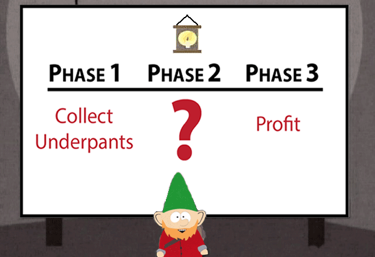
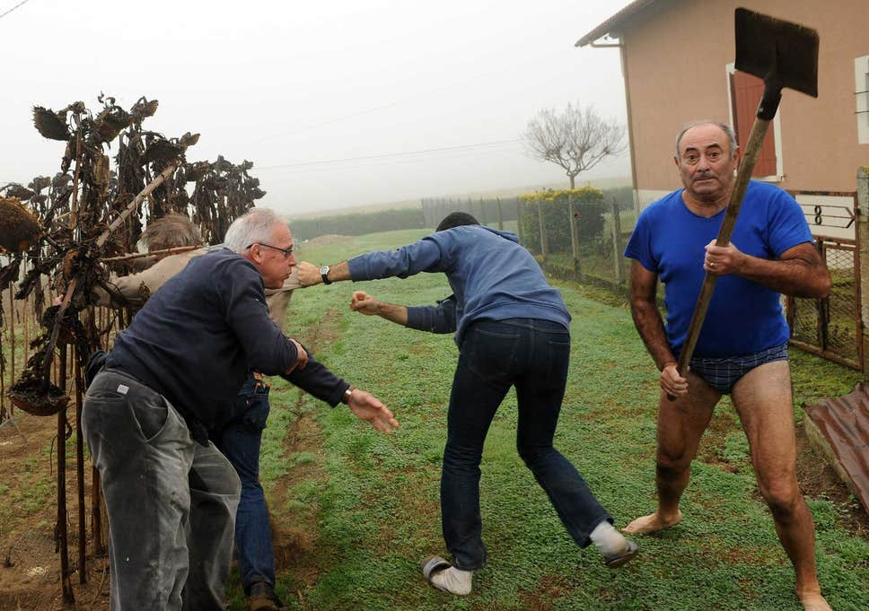
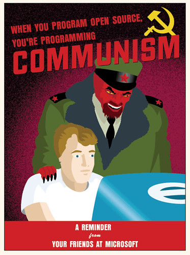
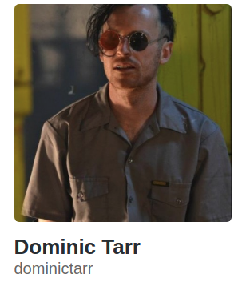
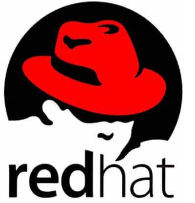
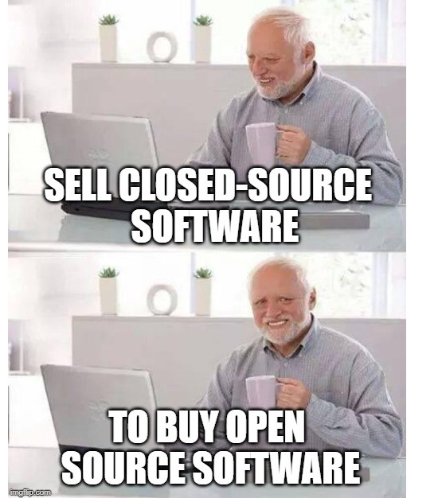
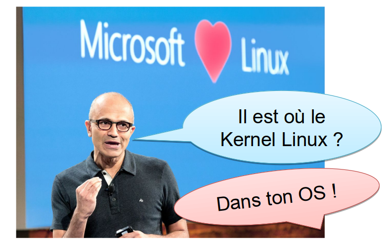

<!-- _class: lead -->

# Le (logiciel) libre a-t-il 
# de beaux jours devant lui ?

---

## ~# whoami

Denis GERMAIN

🌅 SRE chez 

🌃 Auteur sur [blog.zwindler.fr](https://blog.zwindler.fr)*

 @zwindler / @zwindler_rflx

**#geek** 🎮 **#SF** 🤖 **#courseAPied** 🏃‍♂️

 

**Les slides de ce talk sont sur le blog*

---

## 

TODO

---

## Que fait un SRE chez  ?

TODO

---

<!-- _class: lead -->

# Le (logiciel) libre a-t-il 
# de beaux jours devant lui ?

---

<!-- _class: lead -->

# Dis papa, c'est quoi le (logiciel) libre ?

---

## Logiciel Libre

Logiciel libre (définition GNU) 

* « Logiciel libre » désigne des logiciels qui respectent la liberté des utilisateurs.

* [...] Les utilisateurs ont la liberté d'exécuter, copier, distribuer, étudier, modifier et améliorer ces logiciels.

> « Free as in free speech, not free beer »

---

# Culture libre

Le libre ne se limite pas au développement logiciel

 

---

## Open Source (≠ Logiciel Libre)

Open source (définition GNU toujours)

* En 1998, une partie de la communauté a […] commencé à faire […] de l'« open source »

* Le mouvement open source vise à promouvoir le logiciel libre en lui retirant l’aspect idéologique (= politique)

---

## Free software versus Open source software

Dans la pratique,

* Cette distinction est très peu connue du « grand public IT »
* De nombreux logiciels dits « open source » sont « libres »

---

<!-- _class: lead -->

# "Libre bashing"

Crédits : AFP

---

## Voici comment on est vu de l’extérieur

Guillaume Meurice (France Inter) est au Paris Open Source Summit

<video controls="controls" width="800" src="binaries/meurice.mp4"></video>

---

## Ennemi (historique) de l’Open Source ?

<video controls="controls" width="800" src="binaries/microsoft_dance.mp4"></video>

---

## Ennemis de l’Open Source ?

> **Linux est un cancer** qui, au sens de la propriété intellectuelle, corrompt ce qu’il touche

Steve Ballmer (PDG) en 2001 
(*crédits : Dan DeLong*)

---

## Ennemis de l’Open Source ?

> Il existe des **communistes d’un genre nouveau**, qui souhaitent abolir toute forme de rémunération pour les musiciens, artistes du cinéma et développeurs de logiciels

Bill Gates en 2005

---

## Libre bashing en entreprise

Dans le top10 des éditeurs de logiciels dans le monde, 4 sont (très) connues pour leur catalogue de "logiciels propriétaires"

TODO

---

## 

[zwindler.fr - l’open source bashing a encore de beaux jours devant lui](https://blog.zwindler.fr/2018/10/19/lopen-source-bashing-a-encore-de-beaux-jours-devant-lui/)

---

##  "On collecte, on connecte, ça marche"

---

## 

MySQL est la base de données open source la plus populaire au monde grâce à sa fiabilité, sa facilité d'utilisation et ses performances avérées. (*source : oracle.com*)

 

Si vous utilisez MySQL, vous allez devoir sacrifier énormément de stabilité, sécurité et performance. C’est un très vieux système.
**Larry Ellison (PDG d’Oracle) en 2018**

[Tech republic - Why does Oracle keep trashing its own product](https://www.techrepublic.com/article/why-does-oracle-keep-trashing-mysql-its-own-product/)

---

<!-- _class: lead -->

# La communauté Open Source

---

## La communauté Open Source

Les gestionnaires de dépendances / paquets / modules

 **install**

---

## La communauté Open Source

Les gestionnaires de dépendances / paquets / modules

 **install**

TODO npminstall.mp4

[https://twitter.com/garrows/status/1065217184643768320](https://twitter.com/garrows/status/1065217184643768320)

---

## La communauté Open Source

* Développeur, mainteneur unique de event-stream

* Package NPM très populaire avec plusieurs millions (!!!) de téléchargements hebdomadaires

* Plus maintenu depuis des années

* Utilisé par de très nombreux packages 
  * *(Et donc de très nombreux logiciels)*

---

## Et là, c’est le drame

[https://github.com/dominictarr/event-stream/issues/116](https://github.com/dominictarr/event-stream/issues/116)

---

## Les "dangers" de l'Open Source

## TODO

Rubocop
https://twitter.com/bitfield/status/1269975970200641537?s=19

---

<!-- _class: lead -->

# Qui pour sauver l'open source ?

---

## Open source versus Proprietary

FIRST
**THEY IGNORE YOU.**
THEN
**THEY LAUGH AT YOU.**
THEN
**THEY FIGHT YOU.**
THEN
**YOU WIN.**

---

## Redhat; **the** OSS company

Créée en 1993, entreprise surtout connue pour Redhat Entreprise Linux, CentOS, Fedora, Openshift, ...

* Souvent citée en exemple de l’open source "qui marche"
* 3.4 Md$ de chiffre d'affaire en 2019

---

## Et là, c'est le drame (oui, encore...)

---

## IBM + redhat = ❤️

---

<!-- _class: lead -->

# Qui contribue le plus ?

---

## Qui contribue le plus ?

Redhat ? C'est leur coeur de métier après tout
* NOPE !

TODO

---

## Qui contribue le plus ?

> "Indice sur vos écrans"

**C'est un cloud provider connu**

* ... mais ce n'est certainement pas eux !
* Amazon

TODO

---

## Qui contribue le plus ?

Même s'ils sont bons 2èmes, ce n'est pas eux non plus

* 
* 

---

## Les ~~ennemis~~ amis de l'Open Source

> « We are all in on open source » 

Satya Nadella (CEO actuel de Microsoft)

[Etude "State of the octoverse" 2018](https://octoverse.github.com)

---

## Encore plus amis de l'Open Source

* 2017 - Microsoft rejoint l'Open Source Initiative 

* 2018 - Microsoft libère 60k brevets et achète 

* 2019 - La FSF  donne une conférence à Redmond !

[Microsoft saute le pas et met 60 000 brevets à disposition de Linux](https://siecledigital.fr/2018/10/12/microsoft-saute-le-pas-et-met-60-000-brevets-a-disposition-de-linux/)

---

## Toujours plus amis de l'Open Source

* 2019 - Ajout du noyau Linux dans Windows 10

* 2020 - Conférence Linux aurait du avoir lieu au siège , à Redmond !

[https://www.wslconf.dev/wslconf1]()

---

<!-- _class: lead -->

## TODO La guerre du cloud

https://blog.sentry.io/2019/11/06/relicensing-sentry
https://twitter.com/Skeptikon1/status/1192106002457473030
https://github.com/todogroup/survey/tree/master/2019

---

<!-- _class: lead -->

## TODO culture libre

--- 

<!-- _class: lead -->

## TODO Le libre pour sauver le monde

https://framapiaf.org/@sebsauvage/104663776259527309
https://mamot.fr/@tnoisette/104647061959753272
https://mamot.fr/@tnoisette/104647071206510013

---

## Et  dans tout ça ?

Nous aussi, on s’ouvre à l’Open Source

* De nombreux développeurs contribuent (et les OPS aussi !)

* Plusieurs projets open-sourcés sur Github [github.com/deezer](https://github.com/deezer)
  * En particulier 

Et plus à suivre !

---

<!-- _class: lead -->

# Conclusion

---

## Conclusion [Sarcarsm ON]

* Logiciel libre != Logiciel Open Source
  * *et tout le monde s’en fout™ 

* Le libre, ce n’est pas que des logiciels

* L’Open Source c’est le cancer
  * *sauf si on peut faire de l’argent avec

* Faire de l’Open Source fait de vous un ZADiste néocommuniste....
  * ... mais arrêter de maintenir vos projets Open Source met la vie de millions d’innocents en danger

---

## Conclusion [Sarcasm OFF]

Une situation résumée en deux tweets

[https://twitter.com/BenLesh/status/1119770730185363456?s=19](https://twitter.com/BenLesh/status/1119770730185363456?s=19)

---

## That's all folks

---

<!-- _class: lead -->

# Des questions ?
# Ca vous a plu ?

---

ICE Palantir

---

## Déclaration versus actes

---

## Et l'état dans tout ça ?

https://twitter.com/etiennegonnu/status/1218202788699820037?s=19

---

https://windows.developpez.com/actu/293901/La-FSF-envoie-a-Microsoft-un-disque-dur-vide-pour-recuperer-le-code-source-de-Windows-7-et-demande-a-l-entreprise-de-tenir-aux-engagements-qu-elle-a-pris-envers-la-communaute-du-logiciel-libre/

https://boxofcables.dev/microsoft-and-open-source-an-unofficial-timeline/amp/?__twitter_impression=true

---

https://twitter.com/lea_linux/status/1217523083319431170?s=19

https://twitter.com/Arawa_fr/status/1262129262951305216?s=19

Zimbra open core
https://twitter.com/abrianceau/status/1293837833979994114?s=20

https://www.linkedin.com/posts/moula-badji-8550b773_vague-de-licenciements-chez-vmware-channelnews-activity-6700516507459428352-J0Lt

https://twitter.com/VictorStinner/status/1295237763697180672?s=20

https://botsin.space/@xkcdbot/104706923054981209

https://twitter.com/nextinpact/status/1296067530763595776?s=20

https://twitter.com/liamosaur/status/1296305262144364544?s=20

https://framapiaf.org/@sebsauvage/104756899715214271

